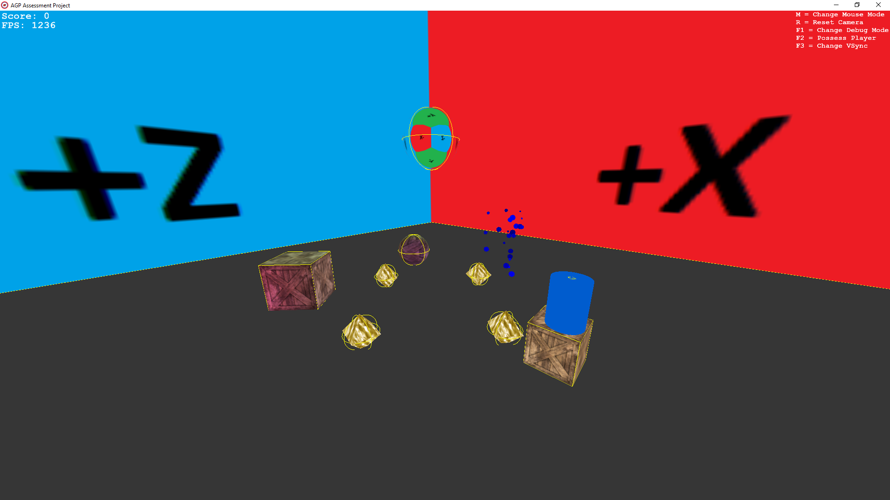

# AGP-Assessment-Project
Advanced Graphical Programming Assessment Project (3D C++ Game/Demo In Visual Studio Using DirectX11)

  

## Insights

This is a 3D graphical demo project which utilizes D3D11 to render the world. It also contains a set of
core systems such as lighting, particles, materials, debugging and a rudementary physics system. 
